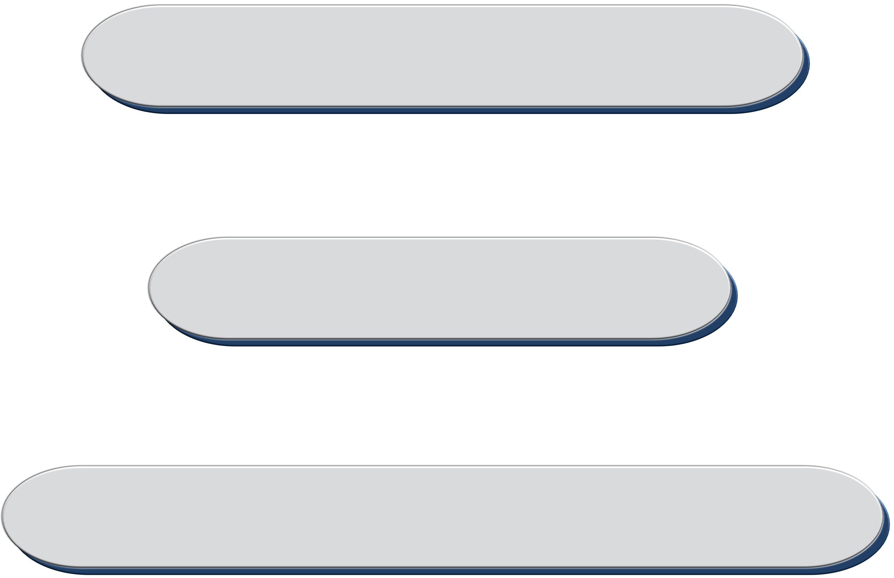

# NFT template

<br/>
<p align="center">
<a href="https://webdriedesign.nl" target="_blank">

</a>
</p>
<br/>

## Technology Stack & Tools

- [Solidity](https://docs.soliditylang.org/en/latest/index.html) (High-level language for implementing smart contracts)
- [OpenZeppelin](https://docs.openzeppelin.com/contracts/4.x/) (A library for secure smart contract development)
- [Brownie](https://eth-brownie.readthedocs.io/en/stable/toctree.html#) (Python development framework for Ethereum)
- [Pinata](https://docs.pinata.cloud/) (Cloud-based InterPlanetary File System service provider; no need to run IPFS node by yourself)
- [Hashlips Art Engine](https://github.com/HashLips/hashlips_art_engine) (Javascript based library that generates artworks based on provided layers)
- [Ganache](https://www.trufflesuite.com/ganache) (Local Blockchain environment)
- [Infura](https://docs.infura.io/infura/) (Blockchain API to connect to a Testnet or a Mainnet; no need to run own Blockchain node)
- [Alchemy](https://docs.alchemy.com/alchemy/) (Blockchain API to connect to a Testnet or a Mainnet; no need to run own Blockchain node)

## Requirements For Initial Setup
Please install or have installed the following:

- [NodeJS and NPM](https://nodejs.org/en/download/)
- [Python](https://www.python.org/downloads/)


## Installation

1. [Install Brownie](https://eth-brownie.readthedocs.io/en/stable/install.html), if you haven't already. Here is a simple way to install brownie.


```bash
python3 -m pip install --user pipx
python3 -m pipx ensurepath
# restart your terminal
pipx install eth-brownie
```
Or, if that doesn't work, via pip3
```bash
pip3 install eth-brownie
```

2. Download the repository


If you are cloning the project then run this first, otherwise you can download the source code on the release page and skip this step. 


```bash
git clone https://github.com/vsevdrob/nft-brownie-mix
cd nft-brownie-mix
```


3. Install Hashlips Art Engine dependencies:


Go to the `./hashlips_art_engine` and run the following command if you have `yarn` installed.
```bash
yarn install
```
Alternatively you can run this command if you have `node` installed.
```bash
npm install
```


## Testnet Development
If you want to be able to deploy to testnets, do the following.

Set your `WEB3_INFURA_PROJECT_ID`, and `PRIVATE_KEY_TEST` [environment variables](https://www.twilio.com/blog/2017/01/how-to-set-environment-variables.html).

You can get a `WEB3_INFURA_PROJECT_ID` by getting a free trial of [Infura](https://infura.io/). At the moment, it does need to be infura with brownie. If you get lost, you can [follow this guide](https://ethereumico.io/knowledge-base/infura-api-key-guide/) to getting a project key. You can find your `PRIVATE_KEY` from your ethereum wallet like [metamask](https://metamask.io/).

If you want to auto-upload to pinata instead of IPFS automatically, you can do so by getting a [Pinata API Key.](https://pinata.cloud/documentation#GettingStarted)

You can add your environment variables to a `.env` file. You can use the [.env.example](https://github.com/vsevdrob/nft-brownie-ipfs-pinata-hashlips/.env.example) as a template, just fill in the values and rename it to `.env`.

Here is the example of how `.env` should look like:
```
export WEB3_INFURA_PROJECT_ID='Ba41Bac12341'
export PRIVATE_KEY_TEST='Ab678bCbc126'
export PINATA_API_KEY_TEST='53hHlhjrw124h1h2'
export PINATA_API_SECRET_TEST='jJF234JEwqekq2'
```

You can also [learn how to set environment variables easier](https://www.twilio.com/blog/2017/01/how-to-set-environment-variables.html)

Then, make sure your `brownie-config.yaml` has:

```
dotenv: .env
```

 **WARNING** 

DO NOT SEND YOUR PRIVATE KEY WITH FUNDS IN IT ONTO GITHUB

Otherwise, you can build, test, and deploy on your local environment.


You'll also need testnet rinkeby ETH. You can get ETH into your wallet by using the [rinkeby faucets located here](https://faucets.chain.link/rinkeby). If you're new to this, [watch this video.](https://www.youtube.com/watch?v=P7FX_1PePX0)


## Local Development

For local testing [install ganache-cli](https://www.npmjs.com/package/ganache-cli)
```bash
npm install -g ganache-cli
```
or
```bash
yarn add global ganache-cli
```

All the scripts are designed to work locally or on a testnet. You can add a ganache-cli or ganache UI chain like so:
```
brownie networks add Ethereum ganache host=http://localhost:8545 chainid=1337
```
And update the brownie config accordingly.


## Usage

### With hashlips art engine

1. Setup `hashlips_art_engine`

* Clone the official repo by running this command in the project root directory `./nft-brownie-mix`:

```bash
git clone https://github.com/HashLips/hashlips_art_engine.git
```

* With the help of the haslips documentation generate your first images. You know you fulfilled it right if the directory `./nft-brownie-mix/hashlips_art_engine/build/images` contains of satisfied images.

2. Add `HASHLIPS = {"enabled": True}` in `./scripts/utils/config.py`.

### Without hashlips

1. Add manually the image(s) into `./img`.

### General

1. Go to `./scripts/collectible/config.py` and provide some configurations applied to your wishful collection by replacing the values in this variables:

```python
COLLECTIBLE = {
    "name": "Super Art Collection", # <- 
    "symbol": "SAC", # <-
    "contract_URI": "", # ipfs://Qw1234Dd # <-
    "royalty_receiver": "0x8626f6940e2eb28930efb4cef49b2d1f2c9c1199", # <-
    "royalty_fraction": 250,  # e.g. 100 (1%); 1000 (10%)
}

"""
Is collection considered as a single edition collection?
    - YES: SINGLE_EDITION_COLLECTION["enabled"] = True
    - NO: SINGLE_EDITION_COLLECTION["enabled"] = False
"""
SINGLE_EDITION_COLLECTION = {
    "enabled": True,
    "file_name": "image_name.png",  # Provide the literal name of the image in ./img
}

AMOUNT_TO_MINT = 1 if SINGLE_EDITION_COLLECTION["enabled"] else 10  # <-

SPREADSHEET = {
    "enabled": False,  # <-
    "trait_types": [],  # <- # first row columns after | ID | NAME | DESCRIPTION | CREATOR | ARTIST | 1st trait type | 2nd ...
}

"""
@dev If SPREADSHEET is disabled and SINGLE_EDITION_COLLECTION is disabled:
@dev name = "Name" + f"# {_token_id}"
@dev description = "Description"
@dev creator = "Creator"
@dev artist = "Artist"

@dev If SPREADSHEET is disabled and SINGLE_EDITION_COLLECTION is enabled:
@dev name = "Name"
@dev description = "Description"
@dev creator = "Creator"
@dev artist = "Artist"

@dev If SPREADSHEET is enabled and SINGLE_EDITION_COLLECTION is enabled:
@dev name = <NAME PROVIDED IN SPREADSHEET UNDER ID 1>
@dev description = <DESCRIPTION PROVIDED IN SPREADSHEET UNDER ID 1>
@dev creator = <CREATOR PROVIDED IN SPREADSHEET UNDER ID 1>
@dev artist = <ARTIST PROVIDED IN SPREADSHEET UNDER ID 1>

@dev If SPREADSHEET is enabled and SINGLE_EDITION_COLLECTION is disabled:
@dev name = <NAME PROVIDED IN SPREADSHEET UNDER ID #>
@dev description = <DESCRIPTION PROVIDED IN SPREADSHEET UNDER ID #>
@dev creator = <CREATOR PROVIDED IN SPREADSHEET UNDER ID #>
@dev artist = <ARTIST PROVIDED IN SPREADSHEET UNDER ID #>
"""
COLLECTION = {
    "description": "This collection represents ...",  # <-
    "artwork": {
        "name": "Name" if not SPREADSHEET["enabled"] else None,  # <-
        "description": "Description" if not SPREADSHEET["enabled"] else None,  # <-
        "creator": "Creator" if not SPREADSHEET["enabled"] else None,  # <-
        "artist": "Artist" if not SPREADSHEET["enabled"] else None,  # <-
        "additional_metadata": {
            "enabled": False,  # <-
            "data": {
                "extra key 1": "value",
                "extra key 2": "value",
                # ...
            },
        },
    },
    "external_link": {
        "enabled": False,  # <-
        "base_url": "https://yourwebsite.io/",  # <-
        "url": "https://yourwebsite.io/super-art-collection/",  # <-
        "include_token_id": False,  # e.g. https://yourwebsite.io/super-art-collection/123 # <-
    },
}
```


2. Deploy `Collectible.sol` smart contract and mint the first NFTs:

* On `development` network:

Start the brownie console:

```bash
brownie console
```

In that console execute the functions:

```bash
run("scripts/deploy/deploy_collectible.py")
```
```bash
run("scripts/main.py")
```

* On `rinkeby` test network:

Simply run this commands in your terminal window:

```bash
brownie run scripts/deploy/deploy_collectible.py --network rinkeby
```
```bash
brownie run scripts/main.py --network rinkeby
```


## Resources

To get started with Brownie:

* Check out the [Brownie mixes](https://github.com/brownie-mix/) that can be used as a starting point for your own contracts. They also provide example code to help you get started.
* Check out the [Chainlink documentation](https://docs.chain.link/docs) to get started from any level of smart contract engineering. 
* ["Getting Started with Brownie"](https://medium.com/@iamdefinitelyahuman/getting-started-with-brownie-part-1-9b2181f4cb99) is a good tutorial to help you familiarize yourself with Brownie.
* Cognitive [Brownie tutorial](https://github.com/curvefi/brownie-tutorial) by Curve Finance.
* For more in-depth information, read the [Brownie documentation](https://eth-brownie.readthedocs.io/en/stable/).
* Ultimate Solidity, Blockchain, and Smart Contract - Beginner to Expert [Full Course](https://github.com/smartcontractkit/full-blockchain-solidity-course-py) | Python Edition 

## License

This project is licensed under the [MIT license](LICENSE).
